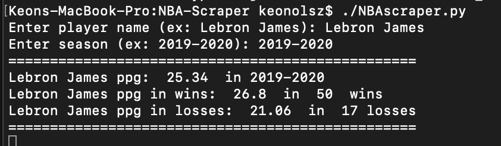
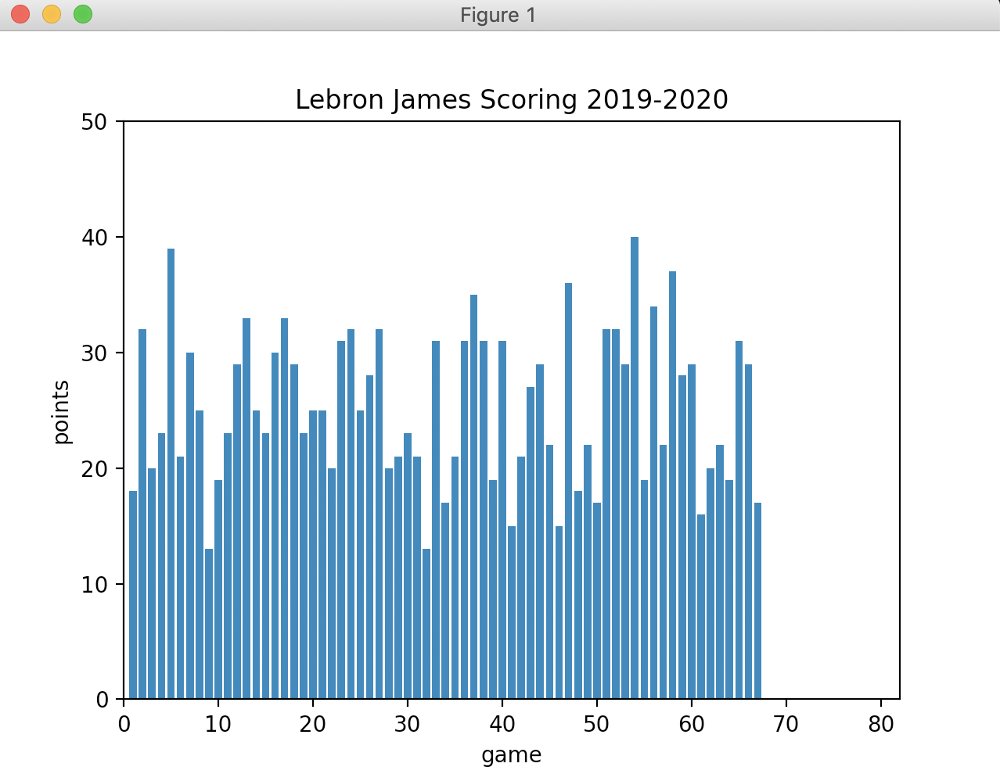

# NBA-Scraper
Tool to ethically scrape https://www.basketball-reference.com  NBA game statistics to be used in data analytics and advanced statistics. The point of this tool is not to have an extensive databse of stats, sites like https://www.basketball-reference.com already do a great job of that. Instead, this is to be used to fetch particular statistcs of interest (player stats, team stats, game logs) and then us them to more easily analyze trends and calculate more advanced statistical measurments.
# Example of Functionality

